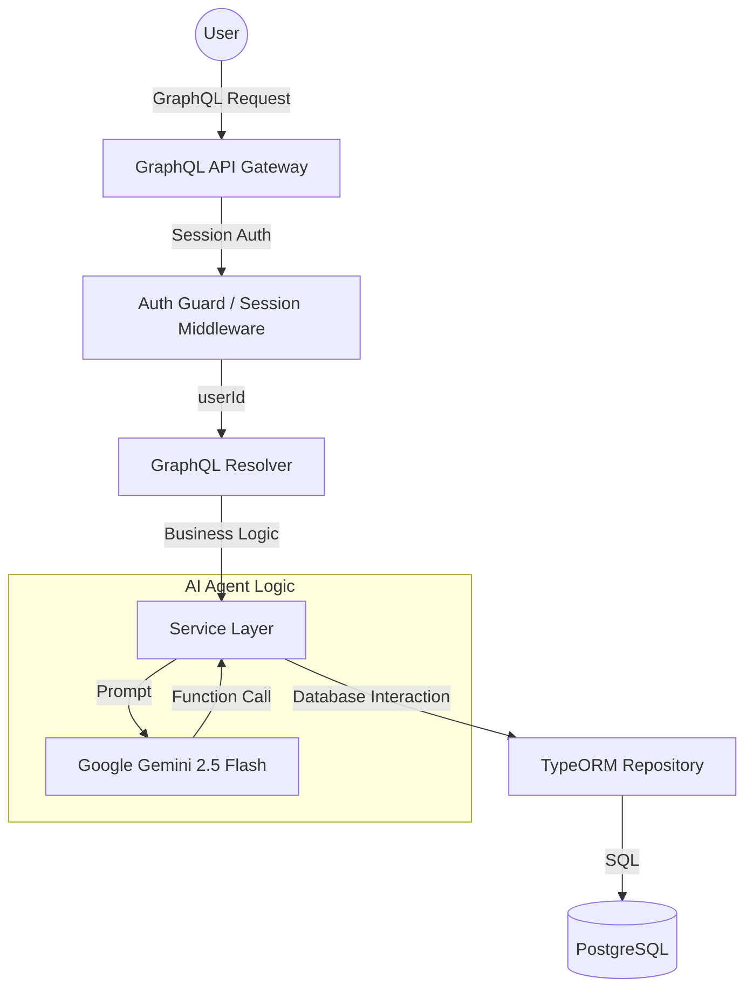

# Helpexa Backend Documentation (PostgreSQL + GraphQL)

This document provides a comprehensive overview of the Helpexa backend architecture, technology stack, and data flow.

## 🏗 Architecture Overview

The Helpexa backend is built using **NestJS**, a progressive Node.js framework. It follows a modular architecture where each domain (HR, ITSM, Expense, AI) is isolated into its own module.

### High-Level Flow


---

## 🛠 Technology Stack

| Technology | Purpose | Key Benefit |
| :--- | :--- | :--- |
| **Node.js** | Runtime Environment | High performance, non-blocking I/O. |
| **NestJS** | Framework | Provides structure (Modules, Controllers, Services). |
| **GraphQL** | API Layer | Clients request exactly what they need, nothing more. |
| **TypeORM** | ORM | Maps JavaScript Classes (Entities) to Database Tables. |
| **PostgreSQL** | Database | Robust, relational data storage. |
| **Gemini AI** | Agentic AI | Powers the "Ask AI" feature with real-time data tools. |

---

## 📊 How GraphQL Works in Helpexa

If you are new to GraphQL, think of it as a single endpoint (`/graphql`) that handles all requests. Instead of different URLs, you use different **Queries** and **Mutations**.

### 1. The Schema (The Contract)
GraphQL is "strongly typed." Everything must be defined in a Class with `@ObjectType()`.
- **Entities**: Represent database tables (e.g., `HrRequest`).
- **Models**: Represent data shapes returned to the frontend (e.g., `HrDashboard`).

### 2. Resolvers (The Controllers)
Resolvers are the entry points. They look like this:
```typescript
@Query(() => [HrRequest])
async getHrRequests(@Context() context: any) {
  const userId = context.req.session.userId; // Get logged-in user
  return this.hrService.getHrRequests(userId); // Fetch data
}
```

### 3. Queries vs Mutations
- **Query**: Used for fetching data (like `GET`). Example: `hrDashboard`, `itsmTickets`.
- **Mutation**: Used for changing data (like `POST/PUT`). Example: `applyLeave`, `createTicket`.

---

## 🔒 Multi-Tenancy & Data Isolation

Security is enforced at the **Service Level**.

1.  **Session-Based Auth**: When a user logs in, their `userId` is stored in a secure cookie (Session).
2.  **Context Injection**: Every GraphQL request carries the session. We extract the `userId` in the Resolver.
3.  **Strict Filtering**: Every database query includes a `where: { user: { id: userId } }` clause. This ensures User A can **never** see User B's data, even if they know the ID.

---

## 🤖 Ask AI: Agentic Architecture

The "Ask AI" feature uses **Tool Calling**. Instead of just chatting, the AI can "act."

1.  **System Prompt**: We tell the AI it is "Helpexa AI" and give it a set of tools (functions).
2.  **Function Declarations**: We describe our Service methods to the AI (e.g., `get_hr_requests`).
3.  **Execution Loop**:
    - User asks: "How many leaves do I have?"
    - AI decides: "I need to call `get_hr_dashboard`."
    - Backend runs: `hrService.getHrDashboardData(userId)`.
    - AI receives: Real database data.
    - AI responds: "You have 7 casual leaves remaining."

---

## 📁 Project Structure

- `src/database/entities`: Definition of PostgreSQL tables.
- `src/hr`: HR logic (Leaves, Attendance).
- `src/itsm`: IT Helpdesk logic (Tickets, Assets).
- `src/piAssist`: AI Agent logic (Gemini integration).
- `src/auth`: Session management and Login.
- `manual_setup.js`: Database initialization script.

---

## 🚀 How to Run
1.  Ensure PostgreSQL is running on port `5432`.
2.  Run `node manual_setup.js` to build/rebuild the database.
3.  Run `npm run start:dev` to start the backend.
4.  Access the Playground at `http://localhost:3001/graphql`.
